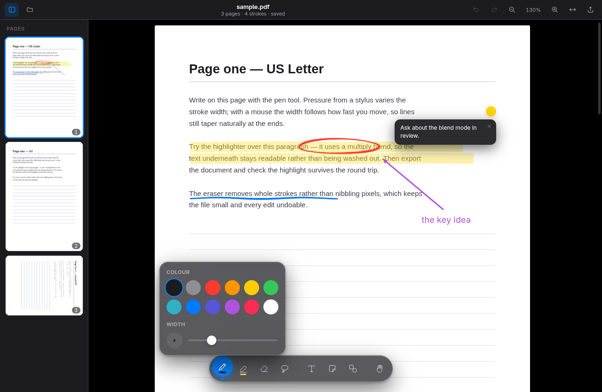
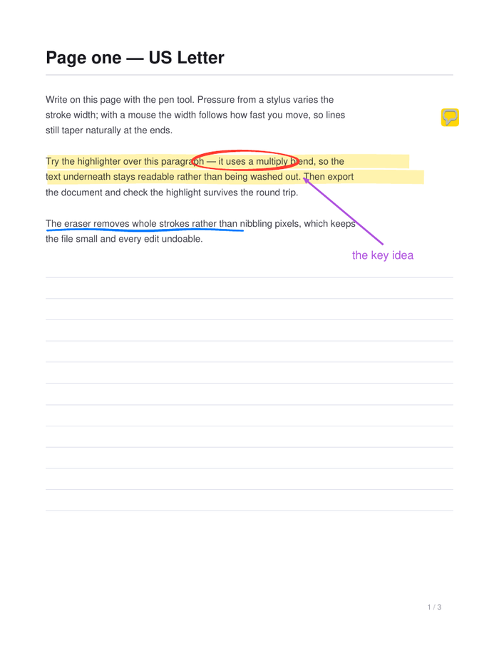

# Inkwell

A desktop PDF reader you can write on. Built for Linux, shipped as an AppImage.

Existing Linux options tend to split the problem in half: viewers that render
PDFs faithfully but annotate badly, and note apps that ink beautifully but treat
the PDF as a dumb backdrop. Inkwell does both - pdf.js rendering underneath a
low-latency, pressure-sensitive vector ink layer.

**Your original PDF is never modified.** Ink lives in a small `.ink.json` file
beside it and stays fully re-editable. Exporting produces a separate flattened
copy for sharing.



---

## Running it

```bash
npm install
npm run sample   # writes sample/sample.pdf to draw on
npm start
```

## Tests

```bash
npm test          # all three suites
```

| Suite | What it proves |
| --- | --- |
| `test:export` | Ink exported to a flattened PDF lands at exactly the page coordinates it was drawn at, including on a `/Rotate 90` page. |
| `test:live-stroke` | The in-progress stroke is painted where the pointer is, and does not move when the pointer is released. |
| `test:objects` | Shapes, text boxes and notes can be removed, stay removed after a repaint, and come back on undo. |
| `test:zoom` | Zooming keeps whatever is under the pointer under the pointer, actually scales the page, and the preset menu applies. |
| `test:unsaved` | Closing with unsaved ink asks first; closing a saved document does not. |
| `test:text` | Text spans sit over the glyphs they describe (measured in PDF points), selection returns the right words, search highlights land on their match, and contents links navigate. |
| `test:sidebar` | Thumbnails keep their height in an overflowing list, history records and travels, and results are grouped by page. |
| `test:open` | A second document can be opened while one is already open, in both directions. |

Each one checks rendered output rather than internal state: they rasterise real
pages or compare real frames. Every coordinate bug this project has had would
have passed a unit test written from the same assumptions as the code.

Needs `poppler-utils`, Python 3 with Pillow, and a display - `xvfb-run -a npm
test` works headless.

## Building the AppImage

```bash
npm run dist
```

The result lands in `release/Inkwell-<version>-x86_64.AppImage`. Mark it
executable and run it - no installation, no runtime dependencies beyond FUSE:

```bash
chmod +x release/Inkwell-*.AppImage
./release/Inkwell-*.AppImage
```

## Making it your PDF viewer

```bash
npm run install:desktop
```

Copies the AppImage to `~/Applications`, installs a launcher and icon under
`~/.local/share`, and sets Inkwell as the handler for `application/pdf`.
Everything lands in your own home directory - no root, nothing outside XDG
directories. To install the launcher without changing your default viewer, pass
`--no-default`; to reverse the whole thing, including handing the PDF
association back to whatever you used before:

```bash
bash scripts/install-desktop.sh --uninstall
```

---

## The writing experience

The point of the app is that writing feels immediate, so most of the
engineering is on the input path.

**Every sample is used.** Chromium delivers pointer events once per frame by
default, which throws away most of what a 240 Hz stylus reports.
`getCoalescedEvents()` recovers the full set - this is the difference between a
curve and a chain of visible facets when you write quickly.

**Work happens once per frame.** Samples are queued as they arrive and drained
in a single `requestAnimationFrame` flush, so a burst of input costs one repaint
rather than twenty.

**The in-progress stroke is isolated.** Each page has separate canvases for
committed ink and the stroke currently under your pen. Adding a point repaints a
transparent overlay instead of every stroke on the page, so the hundredth stroke
draws as fast as the first.

**The stroke model follows the device:**

| Input | Behaviour |
| --- | --- |
| Stylus | True pressure drives width; tilt is captured; the eraser end and the barrel button both erase without changing tools |
| Mouse / trackpad | Width is derived from pointer velocity, so lines still taper naturally instead of being uniform sausages |
| Finger | Pans and pinch-zooms. Never draws |

**Palm rejection.** Once the pen is seen, touch input is suppressed briefly -
including native touch scrolling - so a hand resting on the screen mid-sentence
can neither draw nor scroll the page out from under you.

**The cursor is the nib.** Instead of a crosshair, the pointer *is* the mark you
are about to make: a dot of the exact width and colour of the current tool,
scaled with the zoom. Picking a 24pt highlighter at 200% shows a 48px chisel, so
width is something you judge by eye rather than by reading a slider.

**The palette gets out of the way.** Drag it by its grip to any edge and it
snaps there, turning vertical down the sides, and the page reserves that edge so
nothing is ever hidden underneath it. Where you left it is remembered.

## Reading

Inkwell is a reader as well as an annotator. The **Select text** tool (`8`) turns
the page into real text: drag to select, `Ctrl+C` to copy. It and the **Pan**
tool are the reading modes, where links become clickable - a contents entry
jumps to its page, an external URL opens in your browser.

**Find** (`Ctrl+F`) searches the whole document and opens the sidebar on its
results, grouped by page with the matched phrase in context. Matches are counted
as the scan runs rather than after it, so a long document is usable immediately;
`Enter` and `Shift+Enter` step through them, and highlights are drawn from the
real glyph rectangles so they sit exactly on the words they matched.

The sidebar has three tabs: **Pages** for thumbnails and page operations,
**Results** for the current search, and **History** - every change you have made,
newest first, with the page and time. Clicking an entry travels to that state,
which is undo and redo without counting keystrokes; undone entries stay listed
so going forward again is one click.

The page indicator in the toolbar shows where you are and takes a page number -
type one and press `Enter` to jump.

The toolbar carries controls and nothing else: the document's name and its
unsaved marker are in the window's own title bar, the page count is in the page
indicator, and what you have changed is in the History tab. Nothing is stated
twice.

## Tools

- **Pen** - pressure-tapered ink, twelve colours, 1–16 pt
- **Highlighter** - flat chisel nib with a multiply blend, so text underneath
  stays readable
- **Eraser** - removes whole strokes rather than nibbling pixels, which keeps
  files small and every erase undoable
- **Lasso** - selects ink by enclosure and drags it; Delete removes it
- **Text boxes** - real `contenteditable`, so the caret, selection and IME come
  from the platform and text stays crisp at any zoom
- **Sticky notes** - collapsible comments that export as genuine PDF `/Text`
  annotations other viewers can read
- **Shapes** - line, arrow, rectangle, ellipse, optionally filled
- **Page operations** - rotate, insert blank, delete, drag-to-reorder in the
  sidebar, and append another PDF

Tapping the tool you already have selected opens its settings - the GoodNotes
gesture, which is why the palette can stay a single row. The palette itself is
glass: it blurs and refracts the page beneath it rather than sitting on top as
an opaque bar.

**Removing things.** Anything on a page can go three ways: the eraser takes
strokes, shapes, text boxes and notes on contact; the lasso selects a group and
`Delete` removes it; and text boxes and notes carry their own × button. All of
it is a single undo step.

Everything else - open, save, export, page operations, zoom presets, full
screen - lives behind the **⋯** button in the toolbar. There is no menu bar:
the window keeps its native frame, but the application's own commands live in
the application, next to what they act on.

## Keyboard

| Key | Action |
| --- | --- |
| `1`–`8` | Pen, highlighter, eraser, lasso, text, note, shapes, select text |
| `H` / hold `Space` | Pan |
| `Ctrl+Z` / `Ctrl+Shift+Z` | Undo / redo |
| `Ctrl+O` / `Ctrl+S` / `Ctrl+E` | Open / save notes / export |
| `Ctrl+B` | Pages sidebar |
| `Ctrl+F` | Find in document |
| `Ctrl+G` / `Ctrl+Shift+G` | Next / previous match |
| `Ctrl+C` | Copy selected text |
| `Ctrl` `+` / `−` / `0` / `1` / `2` | Zoom in, out, actual size, fit width, fit page |
| `Ctrl+wheel`, pinch | Zoom about the cursor |
| Click the zoom % | Preset levels and fit modes |
| `Delete` | Delete selection |

---

## How it works

```
src/main/main.js      window, native menu, dialogs, atomic sidecar writes
src/main/preload.js   the only renderer→disk bridge (context isolation on)
src/renderer/
  store.js            document model + undo/redo command stack
  pdfview.js          page layout, virtualised rasterising, zoom, compositing
  ink.js              pointer capture, per-device stroke models, tool gestures
  ink-render.js       stroke geometry, shared by screen and exporter
  objects.js          text boxes and sticky notes as DOM
  export.js           flattening into a new PDF via pdf-lib
  ui/                 tool palette, popovers, thumbnail sidebar, icons
```

### Ink is stored in page space

Strokes are recorded in PDF points with the origin at the page's top-left, on
the *unrotated* page - not in screen pixels. Two things fall out of that: zoom
never degrades a stroke (a line drawn at 50% is sharp at 400%), and rotating a
page moves the paper rather than the notes, so ink keeps its position relative to
the words it annotates.

### Export gets coordinates right by construction

A PDF content stream works in user space (origin bottom-left, y up, unrotated
MediaBox), while ink is stored in viewport space. Rather than hand-deriving that
mapping for each `/Rotate` value, the exporter inverts the very matrix pdf.js
used to lay the page out. That is exact for rotated pages and for pages whose
MediaBox does not start at the origin - the two cases where hand-rolled maths
usually goes wrong. `sample/sample.pdf` deliberately includes a rotated page to
exercise it.

The exported file is the same drawing, not an approximation of it - the
highlighter keeps its multiply blend so text stays readable, and a sticky note
becomes a real PDF `/Text` annotation rather than a coloured square burned into
the page:



### Saving cannot corrupt your notes

The sidecar is written to a temporary file in the same directory and then
`rename`d over the target. Rename is atomic within a filesystem, so a crash or a
full disk mid-write leaves the previous version intact rather than a truncated
one. If ink is added while a save is in flight, the dirty flag is *not* cleared -
those strokes get their own save rather than being silently considered written.

The sidecar records a hash of the source PDF. Opening notes against a PDF that
has since changed warns you instead of quietly placing ink in the wrong spot.

### The text layer is geometry, not decoration

Selection, search and links all ride on pdf.js's transparent text spans sitting
exactly over the rendered glyphs. That geometry depends on CSS variables pdf.js
declares on its own page element, and its stylesheet is extracted from the
installed package at build time rather than hand-copied, so it cannot drift when
pdfjs-dist is upgraded. `test:text` measures a span's position in PDF points
against the coordinates the sample was actually drawn at - the check that would
have caught the layer being silently misplaced.

### Zoom is arithmetic, not measurement

Page positions are computed from the layout constants rather than read back from
the DOM. Measuring every page with `getBoundingClientRect` on every wheel tick
forced a synchronous layout each time, which is what made zooming stutter;
wheel and pinch events are also coalesced into one update per animation frame.
Zoom anchors on the point under the pointer, so the document grows around what
you are looking at instead of sliding away from it.

### Text is rasterised above the display's density

On a 1× display, one canvas pixel per CSS pixel leaves glyph edges no room to
antialias and text reads as soft. Pages are rendered at 1.5× and downsampled by
the browser, within a pixel budget that pulls the factor back at deep zoom
rather than asking for a canvas the GPU will refuse.

### Large documents open immediately

Only the first page is measured up front. Loading every page to collect its
geometry meant a thousand-page file spent a long time - and a lot of memory -
before showing anything; the rest start as copies of page one and are corrected
the moment they actually render. Export resolves any page that carries ink but
was never displayed, so nothing is flattened through an assumed matrix.

### Memory is bounded

Pages rasterise as they approach the viewport and hand their canvases back when
they leave, so page count does not translate into memory. Canvases are created
at zero size rather than the 300×150 default, which across a long document is
real memory for pages nobody has looked at. Zoom shows a scaled
bitmap immediately and re-renders crisply once the gesture settles, which is what
keeps zooming smooth rather than stuttering on every wheel tick.

---

## Known limitations

- **Pressure and tilt are untested on real hardware.** No stylus was available on
  the development machine; those paths were exercised with synthetic `pen`
  pointer events. The mouse and trackpad paths are tested normally.
- Exported text boxes use Helvetica, and characters outside WinAnsi are replaced.
  Ink, shapes and notes are unaffected.
- x86-64 only. An `arm64` AppImage would need the target added to
  `build.linux.target` in `package.json`.

## Contributing

See [CONTRIBUTING.md](CONTRIBUTING.md) - it covers the layout of the code and
the handful of invariants worth knowing before changing anything (the original
PDF is never written to; ink is stored in page space; every mutation goes
through the store's command stack).

## Licence

MIT - see [LICENSE](LICENSE).
